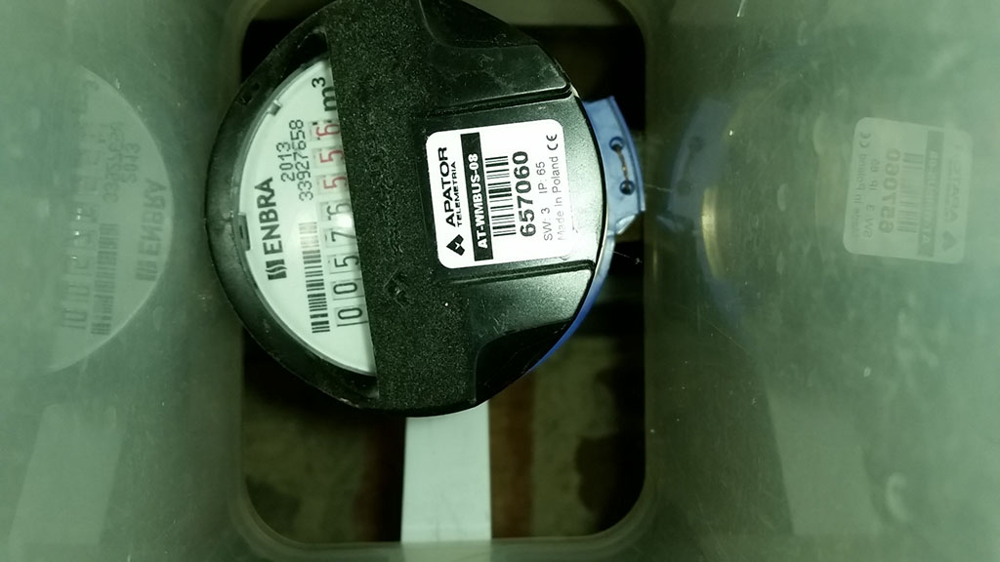

# water-meter
This repository describes a readout an water meter.

## My intention
Readout our water meter and store value in [Home Assistant](https://www.home-assistant.io/).

## Solution
### Taking picture
First I tried ESP32-CAM but the quality of images was poor. And the response time of ESP32-CAM was not stable. Finally I ended up with old mobile phone and the [IP Webcam](https://play.google.com/store/apps/details?id=com.pas.webcam) app installed.
App has simple interface for taking picture http://mobile-phone-ip:8080/photoaf.jpg. Every read result new picture.

### Converting picture to value
I found nice [solution](https://github.com/jomjol/water-meter-system-complete) for converting picture of water meter to digital value. 
This solution use [neural network](https://github.com/jomjol/neural-network-digital-counter-readout#neural-network-approach) approach. Because my watter meter has different style of digits I started training my own network. Details are described [here](https://github.com/jomjol/neural-network-digital-counter-readout#training-the-network).

### Connect to Home Assistant 

